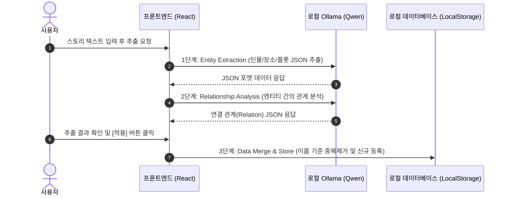
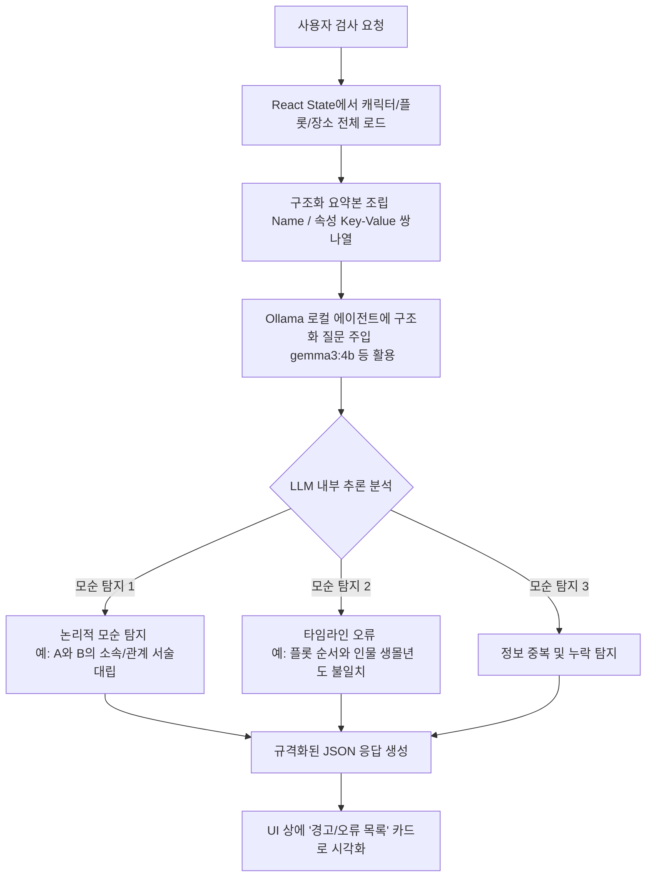

# 시나리오 어시스턴트 AI 기능 동작 메커니즘 가이드

본 문서는 시나리오 어시스턴트 애플리케이션 내 핵심 AI 기능인 **1) AI 스토리 텍스트 데이터 추출/등록** 및 **2) 세계관 무결성 검사**의 기술적 로직과 데이터 흐름을 정리한 개발 및 가이드 문서입니다.

---

## 1. AI 스토리 텍스트 → 데이터 추출 및 등록 로직

사용자가 소설이나 시나리오 원문 텍스트를 입력했을 때, AI가 구조화된 엔티티(인물, 장소, 플롯)와 릴레이션을 추출하여 로컬 데이터베이스에 병합하기까지의 상세 메커니즘입니다.

### 1.1 전체 데이터 흐름 (Sequence Diagram)



### 1.2 단계별 상세 기술 동작

#### **[1단계] Entity Extraction (엔티티 추출)**
* **입력**: 사용자가 작성하거나 입력한 시나리오 원문 텍스트.
* **로직**: 프론트엔드의 `buildExtractPrompt` 함수를 사용해 시스템 역할과 JSON 출력 규격을 LLM(`qwen2.5:7b` 모델 권장)에게 주입합니다.
* **프롬프트 템플릿**:
  ```text
  You are a creative writing assistant. Extract all story entities from the following text and return ONLY a valid JSON object.
  Schema:
  {
    "characters": [{"id": "tmp_1", "name": "이름", "details": {"역할": "...", "성격": "..."}}],
    "plots": [{"id": "tmp_2", "name": "사건명", "details": {"핵심사건": "..."}}],
    "locations": [{"id": "tmp_3", "name": "장소명", "details": {"특징": "..."}}]
  }
  ```
* **결과**: 구조화된 엔티티 데이터가 포함된 1차 JSON을 응답받아 클라이언트가 파싱합니다.

#### **[2단계] Relationship Analysis (엔티티 관계 규명)**
* **입력**: 1단계에서 획득한 인물/장소/플롯 노드와 이들의 임시 ID 목록.
* **로직**: 이 노드들 간의 관계성(예: 가족 관계, 대립 관계, 사건의 장소 매핑 등)을 LLM에게 재질의합니다.
* **프롬프트 템플릿**:
  ```text
  You are a story relationship analyst. Given these extracted story entities, identify relationships between them and return ONLY a valid JSON object.
  Output JSON format:
  {
    "links": [{"fromId": "임시ID", "toId": "임시ID", "type": "관계유형", "description": "관계 설명"}]
  }
  ```

#### **[3단계] Data Merge & Store (데이터 병합 및 저장)**
* **입력**: 최종 합의된 엔티티 + 관계 리스트.
* **로직**: React Context의 `importEntitiesToUniverse` 메서드가 작동하여 브라우저 로컬 데이터베이스와 비교 처리를 수행합니다.
  * **중복 제거 (Merge)**: 가져오려는 엔티티의 이름(`name`)이 기존 데이터베이스에 이미 존재하는 경우, 덮어쓰지 않고 새로운 속성 필드(Details)만을 기존 노드에 합병(Append/Merge)합니다.
  * **신규 등록 (Insert)**: 존재하지 않던 엔티티는 신규 UUID를 발급하여 추가합니다.
  * **관계 연결**: 임시 ID(`tmp_x`)를 최종 등록된 실제 UUID로 맵핑 치환하여 인물-사건-장소를 논리 그래프 구조로 바인딩합니다.
* **최종 저장**: 브라우저의 `LocalStorage`에 직렬화하여 영구 저장합니다.

---

## 2. 세계관 무결성 검사 (Integrity Check) 로직

세계관 내에 작성된 인물 정보, 역사적 사건(플롯), 지리적 배경 간의 **논리적 오류, 시간선(Timeline) 모순, 중복 서술**을 AI 에이전트가 교차 분석(Cross-Analysis)하여 찾아내는 기능입니다.

### 2.1 전체 아키텍처



### 2.2 상세 기술 동작

1. **세계관 데이터 구조적 요약 (Serialization)**:
   * 사용자가 무결성 검사를 실행하면, 프론트엔드(`AIToolsModal.tsx`)는 현재 편집 중인 세계관(Universe)의 모든 캐릭터, 플롯, 장소 목록을 읽어 하나의 가벼운 텍스트 요약본(Context)으로 인코딩합니다.
   * 이는 LLM이 효율적으로 데이터를 대조할 수 있도록 불필요한 이미지 정보 등을 거르고 핵심 텍스트 속성만을 직렬화하는 과정입니다.

2. **교차 분석 프롬프트 (Cross-Analysis Prompt) 구성**:
   * 조립된 데이터 Context와 함께, 에이전트(기본 설정 `gemma3:4b` 등)에게 분석 지침을 전달합니다.
   * 에이전트는 Attention 메커니즘을 사용해 서로 다른 노드(예: 인물 정보 vs 사건 정보)에 기재된 텍스트 서술을 교차 검증합니다.
   * **검사 세부 기준**:
     * **논리적 모순**: 인물의 상태(예: 사망함, 유배됨)와 사건 참여 시점의 상태가 모순되는지 여부.
     * **타임라인 오류**: 역사의 흐름이나 인물의 나이대, 사건 선후 관계가 앞뒤가 맞지 않는 부분 탐지.
     * **설정 중복**: 이름은 다르나 텍스트 내용상 완전히 동일한 인물이나 장소로 판단되는 항목 권고.

3. **결과 리포트 출력 및 렌더링**:
   * 에이전트는 감지된 모순 목록을 규격화된 JSON 구조로 반환합니다.
     ```json
     {
       "conflicts": [
         { "entities": ["아다다", "어머니"], "description": "어머니는 아다다를 심하게 때리고 쫓아냈으나, 아다다의 성격 항목에는 어머니를 깊이 신뢰한다고 적혀있어 서술이 모순됩니다." }
       ],
       "timelineErrors": [],
       "duplicates": []
     }
     ```
   * 프론트엔드는 이 리포트를 받아 경고 카드 UI 형태로 렌더링하여 사용자가 즉각 설정을 보완할 수 있도록 안내합니다.

---

## 3. GraphRAG 세계관 질의와의 차이점

| 구분 | 세계관 무결성 검사 | GraphRAG 세계관 질의 (Q&A) |
| :--- | :--- | :--- |
| **목적** | 전체 데이터의 논리 오류 및 타임라인 모순 감지 | 사용자의 질문에 대해 지식 그래프 기반 지식 답변 |
| **대상 데이터** | 현재 수립된 세계관의 **전체 데이터 구조** 요약본 | 질문에 연관된 **일부 서브 그래프(Sub-graph)** 및 노드 |
| **동작 방식** | 전체 데이터를 텍스트로 전환해 LLM Context Window에 직접 주입 | ChromaDB 벡터 DB 검색을 통해 관련 엔티티/관계만 추출하여 LLM에 전달 |
| **주요 활용** | 시나리오 설정 무결성 유지, 설정 붕괴 방지 | 방대한 소설 플롯으로부터 인과 관계 추적 Q&A 수행 |
